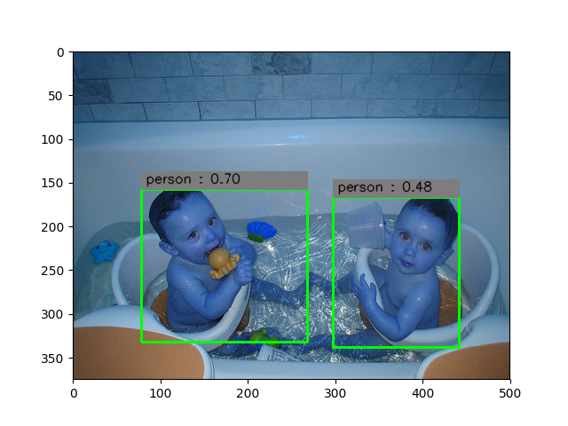
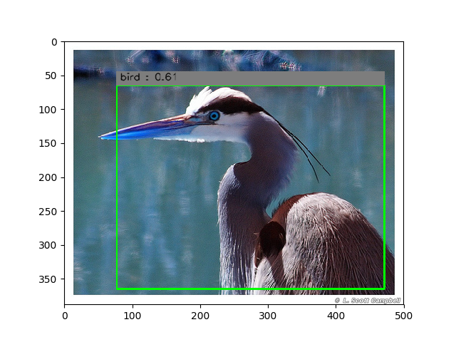
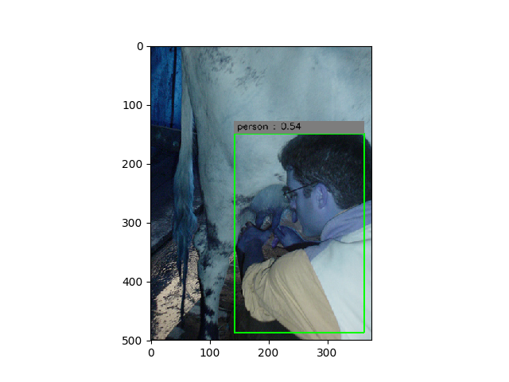
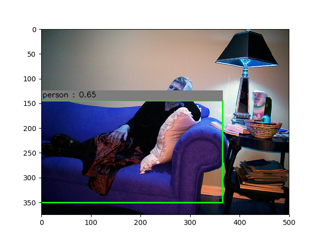

# YOLO-Object-Detection-Tensorflow
YOLO: Real-Time Object Detection using Tensorflow and easy to use







#### 1- Make sure check settings.py before start to train
```python
# remove elements that you don't want
# default objects from VOC 2012
classes_name =  ["aeroplane", "bicycle", "bird", "boat", "bottle", "bus", "car", "cat", "chair", "cow", "diningtable", "dog", "horse", "motorbike", "person", "pottedplant", "sheep", "sofa", "train", "tvmonitor"]
classes_no = [i for i in xrange(len(classes_name))]
classes_dict = dict(zip(classes_name, classes_no))

image_size = 448
cell_size = 7
box_per_cell = 2
alpha_relu = 0.2
object_scale = 2.0
no_object_scale = 1.0
class_scale = 2.0
coordinate_scale = 5.0
flipped = True

decay_step = 30000
decay_rate = 0.1
learning_rate = 0.0001
dropout = 0.5
batch_size = 3
epoch = 1000
checkpoint = 1000

# For main
threshold = 0.2
IOU_threshold = 0.5
test_percentage = 0.05

# 1 for read a picture
# 2 to read from testing dataset
# 3 to read from webcam / video
output = 1
# let empty if want to capture from webcam
picture_name = ''
video_name = ''
```

#### 2- You must download [VOC 2012](http://host.robots.ox.ac.uk/pascal/VOC/voc2012/VOCtrainval_11-May-2012.tar) and put in the same folder for multibox dataset
#### 3- You need to put [YOLO_small.ckpt](https://drive.google.com/open?id=0BxQQlrLbdunWSTZjaHVwUVVOUXM) in the same folder (optional) if you want to use pretrained model, but if you want to train the model by your own, follow 3.*
#### 3.1- You can train your own model from scratch in train-classification folder
#### 3.2- Put your images that you want to classify in train-classification/data/ (need to create it)
```
/
/train-classification
/train-classification/data/
/train-classification/data/fish/
/train-classification/data/cow/
.. so on
```

```bash
python train.py
```
#### 3.3- If you satisfied enough your model, copy model.ckpt into main folder
#### 4- you must train.py in main directory first before main.py (unless if you downloaded YOLO_small.ckpt)
```bash
python train.py
```
#### 5- test in main
```bash
python main.py
```
